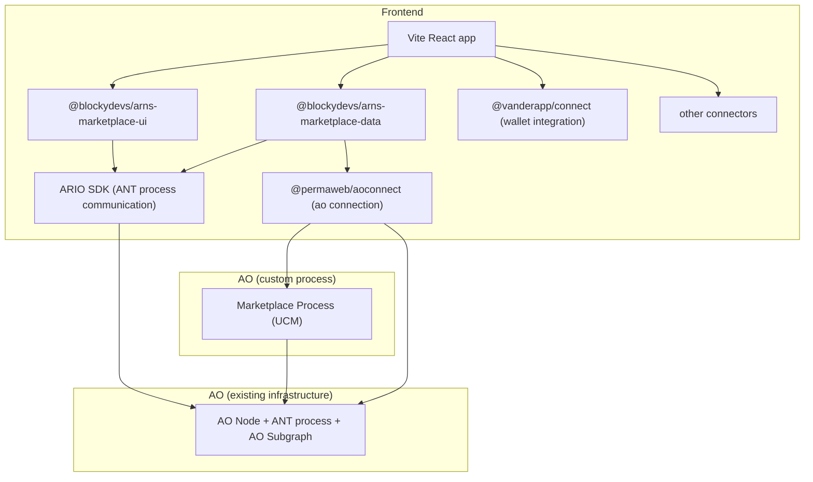
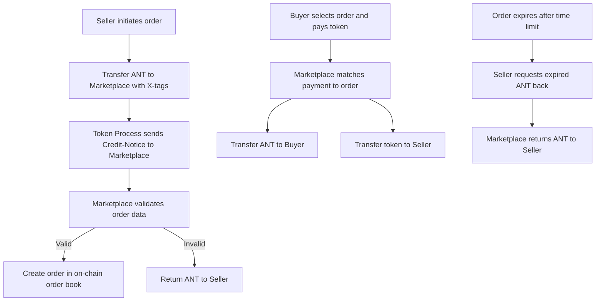
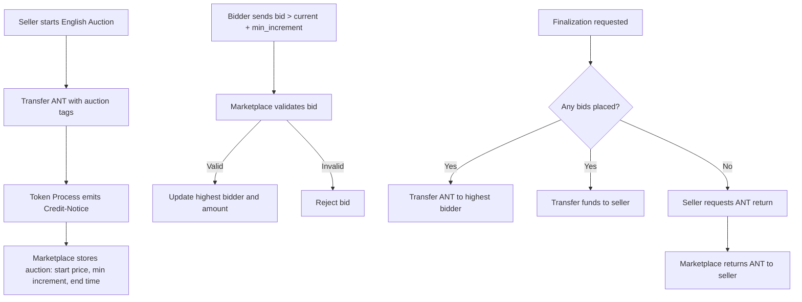
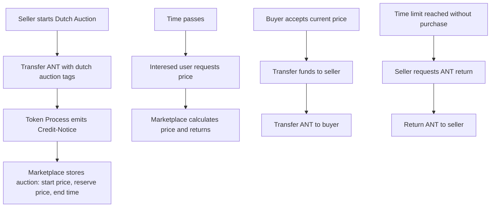
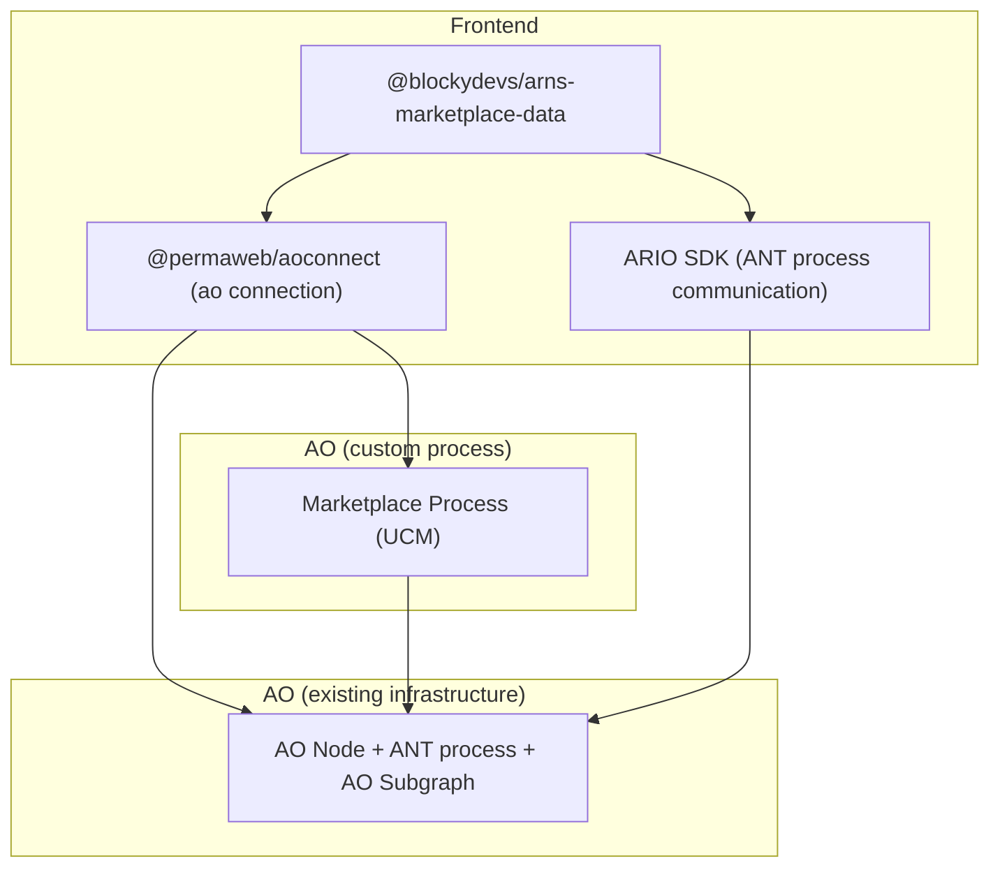
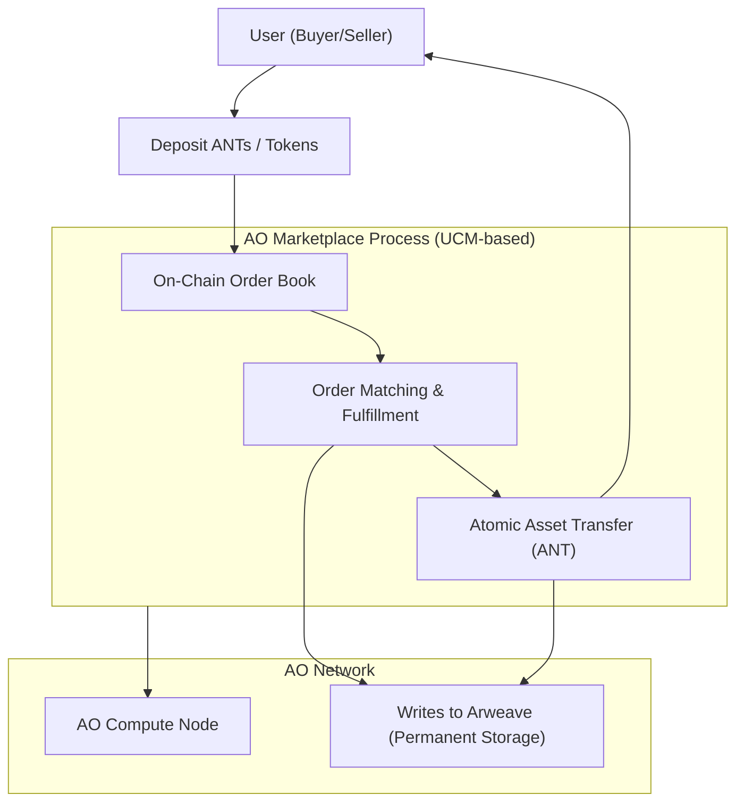
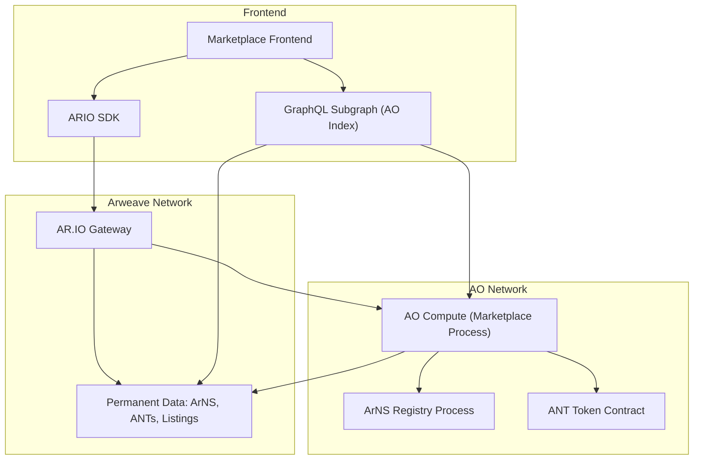

# ArNS Marketplace Architecture

## 1. Marketplace Goal

The ArNS Marketplace aims to enable decentralized, trustless trading of ArNS domains on the permanent web. Domain ownership in ArNS is represented by Arweave Name Tokens (ANTs), which are atomic assets on the Arweave network. The marketplace’s objective is to let users list, buy, and sell these ANTs (domain tokens) entirely on-chain. It does so by leveraging the [**Universal Content Marketplace (UCM)** protocol](https://github.com/permaweb/ao-ucm) – an AO-powered system designed for “trustless exchange of atomic assets”. In practice, sellers deposit their ANTs (or other tokens) with embedded metadata into the ANT Marketplace process, which creates on-chain orders, and buyers fulfill those orders by depositing the required funds. By building on AR.IO’s AO compute layer and UCM, the marketplace ensures all trades are immutable and permissionless, integrating seamlessly with the ArNS naming system and AR.IO’s gateway network.

## 2. General System Components



The AR.IO marketplace architecture consists of the following major components:

* **Front-End App:** A **Vite-powered React application** serves as the user interface. It uses the **@blockydevs/arns-marketplace-data** SDK to communicate with the network. The app integrates wallet support (such as Wander) to sign transactions. The front-end pulls in the custom UI **@blockydevs/arns-marketplace-data** and mentioned data libraries and renders pages for viewing and transacting domains.

* **@blockydevs/arns-marketplace-ui:** This React component library provides pre-built UI elements for the marketplace (described in [Section 3.3](#33-blockydevsarns-marketplace-ui)). It includes domain listing cards, forms for creating or buying listings, dialogs, and other controls. For example, components might include a **DomainCard** (to display a domain name and price), **DomainList** or **SearchBar** components, and **Buy/SellForm** dialogs. These components consume props (such as domain data and callbacks) and are styled to match the AR.IO design. They form the visual layer of the marketplace UI.

* **@blockydevs/arns-marketplace-data:** This TypeScript library supplies the data and logic behind the marketplace (detailed in [Sections 3.4](#34-blockydevsarns-marketplace-data) and [Section 6](#6-arns-marketplace-data)). It exports utility functions and React hooks for fetching and managing data. For example, it provides hooks like `useMarketplaceListings()` or `useUserBalance()` to load current orders and balances, as well as functions to initiate transactions. Under the hood these utilities might call AR.IO’s GraphQL endpoints or AO processes. The library abstracts away raw SDK calls and data parsing for the UI.

* **AR.IO Gateway Node:** AR.IO operates a decentralized network of incentive-driven gateway nodes. These gateways index and cache data from Arweave, serving as “In and Out” access points to the permaweb. In this architecture, gateways relay requests from the front-end to the underlying blockchain. For example, each gateway can resolve ArNS domain names by fetching the latest state of the ArNS registry and associated ANTs from the AO compute layer. Gateways also serve the `@blockydevs/arns-marketplace-data` package requests for blockchain data (e.g. current listings or on-chain state) and can accept transactions on behalf of the user via signed messages.

* **Arweave Network / ArNS:** At its core, the system relies on the Arweave blockchain. The **Arweave Name System (ArNS)** is a smart contract (on AO) that maintains the registry of domain names. Users register names by creating an Arweave Name Token (ANT) process on AO. ANTs act as digital deeds to domain names. The ArNS registry (an AO contract) permanently stores name ownership, pointers, and lease information. In effect, ArNS is a DNS-like system for the permaweb; it is censorship-resistant and on-chain. The marketplace interacts with this system by transferring ANTs between users when trades occur, and by reading domain pointers from ArNS processes.

* **AO:** AO is the hyper-parallel execution layer for Arweave. It runs decentralized compute processes off-chain and posts state to Arweave. In this architecture, AO hosts the **Marketplace Process** as well as existing processes like the ArNS registry and the ANTs processes. AO’s scheduler and compute nodes process the marketplace logic. Using AO allows the marketplace to scale horizontally and verify trades trustlessly, since AO leverages Arweave’s permanence and proof system.

* **AO Compute Nodes & Subgraph:** To execute AO processes (like the marketplace process and ArNS), AO compute units and a message scheduler are used. An **AO GraphQL subgraph** indexes the on-chain message data for fast queries. The front-end libraries can query this subgraph or gateway APIs to get the latest marketplace data, once the transaction is included into Arweave block.

* **Wallet & Connection:** The system uses wallet libraries for user accounts. The AR.IO SDK provides multiple wallet connection to connect to an Arweave-compatibile wallet extension. This allows signing Arweave transactions and messages to AO. The front-end will use wallet connectors such as `@wanderapp/connect` with `ArConnectSigner` to authenticate and send orders.

Together, these components form a layered architecture: the **front-end React app** (with UI/data libs) runs in the user’s browser; it communicates via **AR.IO gateways and the AR.IO SDK** with the **AO compute layer** and **Arweave blockchain**. AR.IO gateways and AO nodes handle the heavy lifting of data retrieval and order execution, while the blockchain and ArNS processes ensure everything is immutable and permissionless.

## 3. Module Breakdown

### 3.1 Marketplace Process

The **Marketplace Process** is an AO-based smart contract (process) implementing the UCM protocol. It runs on the Arweave Orchestrator (AO) network and embodies the core trading logic. When a user wants to place an order, the front-end will initiate a transaction to the marketplace process. This process functions as follows.

#### Order types 

---

**Buy now**
* **Order Creation:** A seller transfers ANT token to the Marketplace AO process, including metadata X-tags that specify the details of the order (which atomic asset to sell, price), which will be forwarded by token process to the Marketplace.

* **Credit/Debit Notices:** Upon receiving a transfer request, the ANT token process process emits a *Credit-Notice* to Marketplace process and a *Debit-Notice* to the sender.  

* **Order Book:** The marketplace process validates that all required X-tags are present and then creates an order in its on-chain order book - if not the Marketplace sends a return. This order includes the swap pair (ANT ↔ ARIO token), amount, and price. 

* **Order Matching:** Another user can fulfill an existing order by transfering the matching ARIO token amount to the marketplace process with the correct tags (or by selecting a “buy” action in the UI). When a buy-order deposit matches an existing sell order, the ArNS marketplace process transfers the domain token (ANT) to the buyer and transfers ARIO tokens to the seller. This happens automatically on-chain via AO’s execution.

* **Order expiration:** Upon expiration, user can request expired ANT listing.




---

**English Auction**  
An **English Auction** is a time-limited ascending price auction where the highest bidder wins.

* **Order Creation:**  
  A seller transfers the ANT token to the Marketplace AO process with X-tags specifying:
  - auction type: `english`
  - starting price
  - minimum bid increment
  - auction duration (end timestamp)

* **Credit/Debit Notices:**  
  Similar to Buy Now, the token process emits a *Credit-Notice* to the Marketplace upon transfer.

* **Order Book:**  
  The Marketplace process registers the auction in the order book with all specified parameters. It tracks the current highest bid and bidder.

* **Bidding:**  
  Bidders send bids (token transfers) to the Marketplace process with appropriate X-tags referencing the auction. Bids below the current highest bid plus the minimum increment are rejected. Process stores only the highest bidder's tokens, previous highest bidder gets a refund.

* **Auction Close:**  
  Once the auction duration expires, any entity can request the finalization. The highest bidder (if any) receives the ANT domain, and the seller receives the winning bid amount. If an auction expires without highest bidder, seller can request a return of the ANT token.



---

**Dutch Auction**  
A **Dutch Auction** is a time-based descending price auction that starts high and decreases until someone accepts the current price.

* **Order Creation:**  
  A seller transfers the ANT token to the Marketplace AO process with X-tags specifying:
  - auction type: `dutch`
  - start price
  - reserve (minimum) price
  - auction duration (start and end timestamp)
  - price decrease interval

* **Credit/Debit Notices:**  
  As with other order types, a *Credit-Notice* is issued to the Marketplace.

* **Order Book:**  
  The order is stored with metadata allowing the price to decay over time linearly. The Marketplace calculates the current price based on request message timestamp.

* **Purchase:**  
  A buyer can accept the current price at any time by submitting a purchase at that value. Once accepted, the ANT is transferred to the buyer and the funds to the seller. The auction ends.

* **Auction Expiry:**  
  If no one buys before the end timestamp, the auction expires. The seller can request ANT token return transfer.




### 3.2 Vite React App

The front-end of the marketplace is a **Vite-powered React application**. Vite provides a fast development and bundling setup for modern web apps. This React app serves as the user-facing ARNS Marketplace application. Its key roles include:

* **UI Rendering:** It imports the marketplace UI components (from `@blockydevs/arns-marketplace-ui`) and arranges pages and navigation.
* **Data Fetching:** It uses the data hooks/utilities (from `@blockydevs/arns-marketplace-data`) to load current listings, user data, and domain info from the network if they were needed outside `@blockydevs/arns-marketplace-ui`.
* **Wallet Connection:** It integrates with wallet providers. The user authorizes transactions through the Wander browser extension and others.

### 3.3 @blockydevs/arns-marketplace-ui

This package is a React component library providing the building blocks of the marketplace interface. It exports reusable components (with TypeScript types) such as:

* **DomainCard:** A component that displays a single domain listing (name, price, owner, action buttons). It is used within lists or search results.
* **DomainList:** A component that renders a grid or table of `DomainCard`s for multiple listings.
* **BuyForm / SellForm:** Modal or form components that allow the user to enter details for a purchase or sale (e.g. set price, confirm transaction).

Each component is designed to receive props such as domain data objects, callback functions, and loading flags. They encapsulate styling and structure so that the main app code can assemble pages by composing these higher-level pieces. (For instance, a “Marketplace” page might map over data to render a `<DomainList>`, and use `<BuyForm>` when the user clicks a buy button.)

### 3.4 @blockydevs/arns-marketplace-data

This utility package contains the data layer for the marketplace. It likely includes:

* **Custom React Hooks:** e.g. `useMarketplaceListings()`, `useUserOrders()`, `useDomainData(domainName)`. These hooks abstract away calls to the AR.IO SDK, GraphQL subgraph or AO calls to fetch necessary data, and return loading and data states.
* **Data Fetching Functions:** For non-React usage, functions like `fetchListings()`, `fetchOrderById()`, etc., which use `fetch` or GraphQL endpoints to retrieve information.
* **Transaction Helpers:** Functions to create and sign transactions for marketplace actions. For example, a `createOrder(assetId, price)` function that wraps the AO calls to place a new order.
* **Utilities & Types:** Common constants, TypeScript types/interfaces for listings and orders, and formatting helpers (e.g. converting token amounts).

In essence, this data module bridges the gap between the frontend UI and the underlying blockchain data. It makes it easy for components to access live marketplace data without dealing with low-level APIs. It may also handle polling or subscriptions to keep the UI updated.



## 4. AO Processes

### 4.1 Marketplace process using UCM

The marketplace is implemented as an AO compute process, specifically using the Universal Content Marketplace (UCM) as base protocol. UCM is inherently an AO contract for atomic asset trading. In practice, the AO Marketplace process will accept deposits and manage its own on-chain order book following UCM’s rules. As described in the UCM specification, *“UCM processes transactions by accepting deposits from buyers or sellers and fulfilling orders based on the specified swap pair, quantity, and … price.”*. This means the marketplace AO contract will automatically enforce trades: when the required funds are deposited, it will transfer ownership of the corresponding ANTs between parties. Using this protocol ensures all computation happens in AO (decentralized and parallelizable) and results are permanently stored on Arweave, fitting the goal of a trustless domain marketplace.



### 4.2 Integration with existing nodes

The ArNS marketplace interconnects with the pre-existing Arweave and AO infrastructure as follows:

* **AO Compute & ANTs:** The Marketplace process runs on AO compute units. It interacts with existing AO-based processes like the ArNS registry and ANTs. (ANTs themselves may be SmartWeave contracts on AO.) For example, when a sale completes, the marketplace process will call into the ANTs contract to transfer the token to the buyer.
* **Arweave Nodes:** All permanent data (ArNS registry, ANTs, subgraph indexes) resides on Arweave. AR.IO gateways usually connect to standard Arweave nodes under the hood. Users do not need to run their own Arweave node; the gateway network provides that connectivity.
* **GraphQL Subgraph:** A GraphQL index (AO Subgraph) compiles blockchain state related to ArNS and the marketplace. The frontend can query this for efficient filtering and pagination of listings, instead of scanning raw on-chain data.
* **AR.IO Gateways:** User could also be sent through AR.IO gateways for fast information retrieval. These gateways fetch permanent data from Arweave and the AO network. Notably, *“each AR.IO gateway acts as an ArNS name resolver,”* retrieving the latest ArNS registry and ANTs from AO compute and serving that state. Thus, when the frontend displays domain information or searches names, it relies on gateways to query AO and return results quickly using ARIO SDK.

Overall, the marketplace app talks to AR.IO gateways (to retrieve data and submit transactions) and to Arweave/AO nodes. This leverages the existing node infrastructure: the gateways serve content, the AO nodes execute processes, and Arweave store the data. As AR.IO’s documentation puts it, *“AR.IO is a network of decentralized gateways… Gateways are the ‘In and Out’ access to Arweave”*.



### 4.3 Relation to the UCM
The marketplace is fundamentally based on UCM, meaning ANTs are treated as *Atomic Assets* in the framework. As documented, *“ANTs are Atomic Asset Spec–compliant AO tokens”* which makes them natively compatible with UCM. In other words, listing an ANT for sale is just like listing any other atomic asset: the AO marketplace contract recognizes the ANT’s process ID and handles its transfer when sold. This close relation means the ArNS marketplace works in harmony with other UCM-based marketplaces (like Bazar). Essentially, our Marketplace process **is** a specialized UCM instance focused on ArNS domains. Using UCM ensures the marketplace benefits from its built-in features (order book, fee mechanism, potential rewards mechanism, etc.). In practice, little needs to be changed in the core protocol; we configure UCM to work with ANTs and ARIO tokens and expose the domain-specific UI on top of it.

## 5. Integration with ArNS App

### 5.1 Overview

ArNS itself is a decentralized naming system on Arweave, allowing users to register permanent web domains (e.g. `ardrive`) and assign them to content. The marketplace integration means that, within the ArNS UI (e.g. *arns.ar.io*), users can not only manage their names but also buy and sell them.

### 5.2 Main changes

Integrating the marketplace adds several features and modules to the existing ArNS app:

* **Marketplace UI Pages:** New screens or tabs for browsing and listing domains. For example, an "ANT Marketplace” section where all domains currently on sale are displayed.
* **Listing Management:** Users can enter their ArNS profile to *list a domain for sale*, set price, or cancel a listing. The `arns-marketplace-ui` components will be used here (e.g. a “Sell” form on the domain detail page).
* **Smart Contract Calls:** Additional AR.IO SDK calls in the front-end code to handle market actions. When a user lists a domain, the app will call the marketplace AO process. When a user buys, it will transfer tokens to that contract and receive the ANT.
* **Queries for Marketplace Data:** The integration will use the `arns-marketplace-data` library to query active listings and order data. This might involve GraphQL queries to the AO subgraph or queries through the AR.IO gateway.
* **Frontend Routing:** The React app’s router may gain new routes like `/marketplace` or `/domain/:name/market`. These will render the higher-level marketplace components from `@blockydevs/arns-marketplace-ui`.
* **Data Sync:** The app will poll or subscribe to updates from AO so that when a trade occurs (even by someone else), the UI reflects the new owner or removed listing.

Overall, the ArNS app will become a unified domain management + trading interface. Users will have seamless flows for viewing, buying, and selling names all in one application.

### 5.3 Higher-level React components

At the application level, new React components will orchestrate the UI flows. These might include:

* **`<MarketplacePage>`:** A top-level page component that displays all available domains. It uses the `ListingList` component and may include filtering controls.
* **`<DomainDetail>` (extended):** The existing domain detail page in ArNS would be extended to show listing info. For example, if a domain is for sale, this component shows the price and a “Buy” button using the `BuyForm` component. It may also allow the owner to “Sell” the domain by opening a `SellForm`.
* **`<ListingList>` and `<ListingItem>`:** These components (from the UI library) would be used within `<MarketplacePage>`. Each `ListingItem` shows a domain card with name, price, owner, and an action button.
* **`<UserDashboard>` (with listing management):** A section of the ArNS app where the logged-in user can see domains they own and optionally list or unlist them.
* **Routing components:** The React Router configuration will have new routes, e.g. `/marketplace` pointing to `<MarketplacePage>`, and route guards to ensure wallet connection.

These high-level components will combine the `ui` library elements (for layout and styling) with the `data` hooks (for fetching and executing actions). For example, `<MarketplacePage>` might internally do:

```jsx
function MarketplacePage() {
  const { listings } = useMarketplaceListings();
  return <ListingList items={listings} />;
}
```

And `<DomainDetail>` might do:

```jsx
function DomainDetail({ name }) {
  const { data: domain } = useDomainData(name);
  const { isForSale, price } = domain;
  return (
    <div>
      <h2>{name}</h2>
      {/* existing domain info */}
      {isForSale 
        ? <button onClick={() => buyDomain(name, price)}>Buy for {price} wAR</button>
        : <button onClick={() => listDomainForSale(name)}>Sell Domain</button>}
    </div>
  );
}
```

By using these higher-level components, the ARNS app seamlessly integrates marketplace features without heavy boilerplate in the main app code. The blockydevs libraries provide much of the needed functionality and interface elements, so developers can assemble the marketplace UI by composing these parts.


## 7. ADRs

| ADR                                    	| Links                                                  	|
|----------------------------------------	|-------------------------------------------------------	|
| ADR-001 Retrieval of ArNS Domain (ANT) Information 	| [Link](/adr/ADR-001-retrieving-arns-domain-info.md) 	|
| ADR-002 Domain Search Architecture in ARNS Marketplace         	| [Link](/adr/ADR-002-search-architecture.md)         	|
| ADR-003 Cancelling an auction | [Link](/adr/ADR-003-cancelling-an-auction.md) |

## Sources

- [ArNS: What is an ANT? - AR.IO](https://ar.io/articles/what-is-an-ant)
- [Universal Content Marketplace (UCM)](https://permaweb-journal.ar.io/reference/ucm.html)
- [ANTs on Bazar - AR.IO Docs](https://docs.ar.io/guides/ants-on-bazar)
- [AR.IO Docs](https://docs.ar.io/build/guides/arns-viewer)
- [What is the ARIO Token? - AR.IO](https://ar.io/articles/what-is-the-ario-token)
- [Arweave Name System (ArNS) - AR.IO Docs](https://docs.ar.io/arns)
- [The Hyper Parallel Computer: AO by Arweave | by jinglingcookies | Medium](https://medium.com/@jinglingcookies/the-hyper-parallel-computer-ao-by-arweave-9aea80b5a166)
- [Domains - AR.IO - The First Permanent Cloud Network](https://ar.io/arns)
